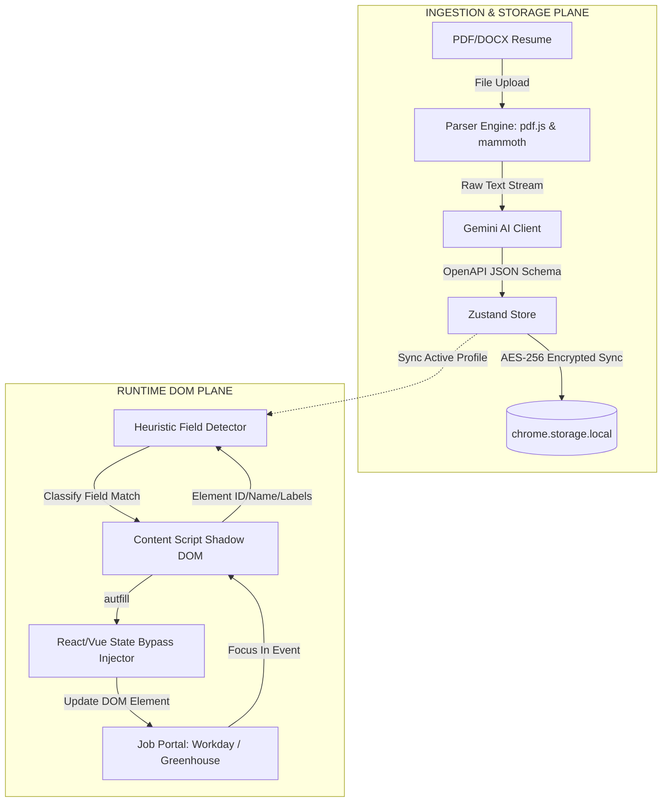
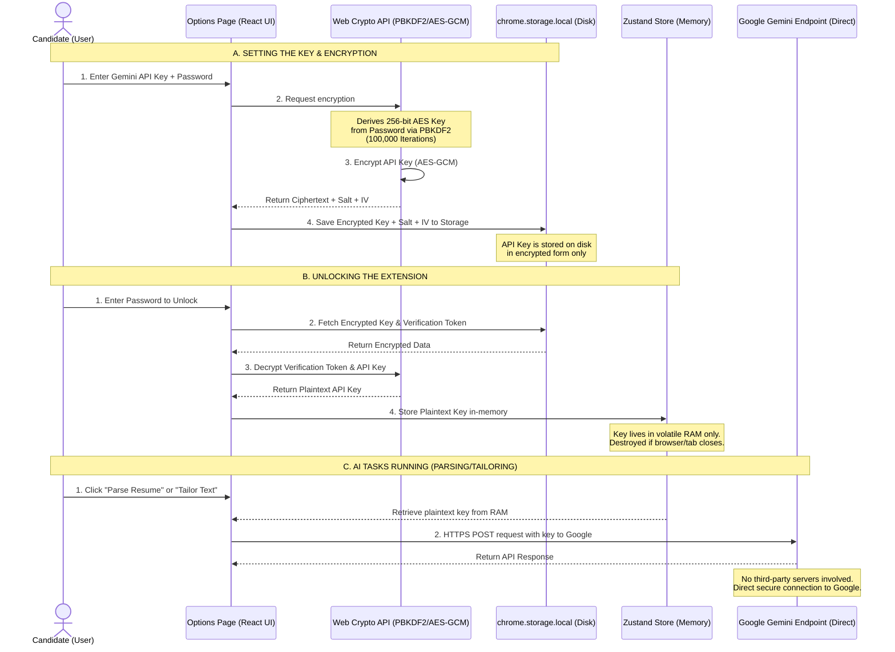

# AutoResume AI - Implementation & Security Specification

This document details the system design, core components, data flows, and local security model of **AutoResume AI**.

---

## 1. System Components Architecture

The extension is divided into two execution planes: the **Ingestion/Storage Control Plane** (where the user manages their files and keys) and the **Runtime DOM Interaction Plane** (where the extension injects buttons and inputs data into job boards).

---

## 2. Processing Layers

AutoResume AI operates across five separate processing layers:

### Layer 1: Client-Side Document Extraction
*   **PDF Ingestion**: `pdfjs-dist` loads the PDF as an array buffer. The worker streams text tokens from individual page elements.
*   **DOCX Ingestion**: `mammoth.js` extracts raw paragraph texts from the open-xml structure in memory.
*   *Note*: Files are parsed completely inside the browser; raw files are never transmitted to any server.

### Layer 2: Schema Extraction & JSON Normalization
*   The raw text is bundled into an instruction prompt.
*   We call Gemini 1.5 Flash, enforcing an exact JSON structure mirroring our TypeScript interface `MasterResumeProfile` via `generationConfig.responseSchema`. This guarantees structured extraction without hallucinations.

### Layer 3: Heuristic Classification (Tiers 1-4)
When an input field receives focus, the `FieldDetector` executes:
1.  **Tier 1 (Explicit attributes)**: Checks `name`, `id`, `autocomplete`, `data-automation-id`, and `placeholder`.
2.  **Tier 2 (Labels)**: Searches the DOM for associated `<label>` tags or surrounding container headers.
3.  **Tier 3 (Proximity)**: Classifies visual sibling text nodes within a vertical bounding box.
4.  **Tier 4 (Fallback)**: Matches custom snippets or triggers textarea selectors (activating the projects carousel).

### Layer 4: Floating closed Shadow DOM Injection
*   The content script injects a closed Shadow Root `attachShadow({ mode: 'closed' })` onto the webpage.
*   Tailwind CSS stylesheet contents are imported as inline strings (`tailwind.css?inline`) and appended inside the shadow root. This ensures styling is isolated from host page stylesheet definitions.
*   The popover widget renders floating next to the input, responding to focus, scroll, and window resize events.

### Layer 5: Framework State-Bypass Injection
*   ATS job forms built on React, Vue, or Angular intercept standard `.value` changes. Setting `input.value = 'john@example.com'` directly fails because the framework's internal virtual DOM does not trigger its state listeners.
*   `setNativeValue` overrides the prototype descriptor setter, updates the value, and dispatches synthetic `input`, `change`, and `blur` events so form validation systems recognize the new data.

---

## 3. Cryptographic API Key Safety Flow

We prioritize the security of the user's personal Gemini API Key. The diagram below illustrates how we keep the key safe at rest and in memory:

### Why Your Key is Safe:
1.  **No Middleman Server**: The extension does not use a central proxy or back-end server. There is no host database where keys can be leaked. All requests go directly to Google's official endpoints.
2.  **Volatile Memory Lifecycle**: When the extension locks or closes, the plaintext key is completely cleared from memory.
3.  **Military-Grade Encryption**: The key is stored on disk encrypted using **AES-GCM (256-bit)**, which is computationally infeasible to decrypt without your master password.
4.  **Local Wipe Control**: If you suspect key exposure, clicking "Permanently Wipe Extension Storage" instantly deletes all verification tokens, resumes, profiles, and keys from Chrome's database.
